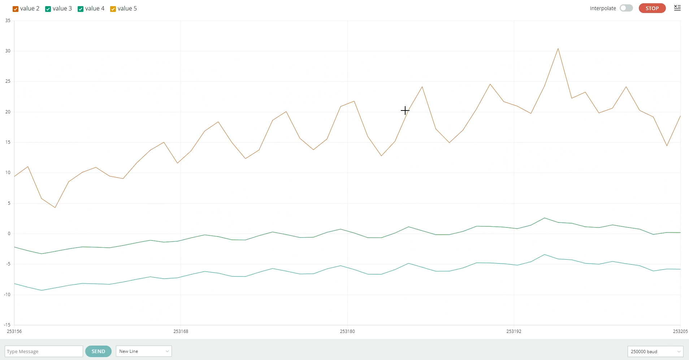

# Aero PID Control

PID controller using two brushless motors with its respective ESC, and an Arduino Mega 2560.

In order for the project to work, make sure to calibrate both ESC before running the main code. You gotta make sure you have installed the [Servo](https://www.arduino.cc/reference/en/libraries/servo/) and [Wire](https://www.arduino.cc/reference/en/language/functions/communication/wire/) Arduino libraries.
    
    #include <Servo.h>
    #include <Wire.h>

I wrote my code making use of the bitwise left shift operator to read MPU's raw accelerometer and gyroscope data, depending of the hexadecimal direction (which is given in the MPU6050's [datasheet](https://invensense.tdk.com/wp-content/uploads/2015/02/MPU-6000-Register-Map1.pdf)). 

You can also use the [MPU6050](https://www.arduino.cc/reference/en/libraries/mpu6050/) library, but I wanted to learn how to handle memory direction between the microcontroller and the sensor (so I can practice my low programming language knowledge).

The structure was created using SolidWorks 3D modeling software. I didn't make any mechanical simulation because I thought it was unnecessary.

Using Fritzing the electronic schematic diagram was made. I had to add some figures from the Fritzing community so I can build up the whole circuit. I used the Arduino Mega 2560 but you can use any other Arduino board as long as SDA and SCL pins are available.

This has the main function to compare my error with my variable of control (PID output) and the actual setpoint I wanted to reach, which was a great success all along.

