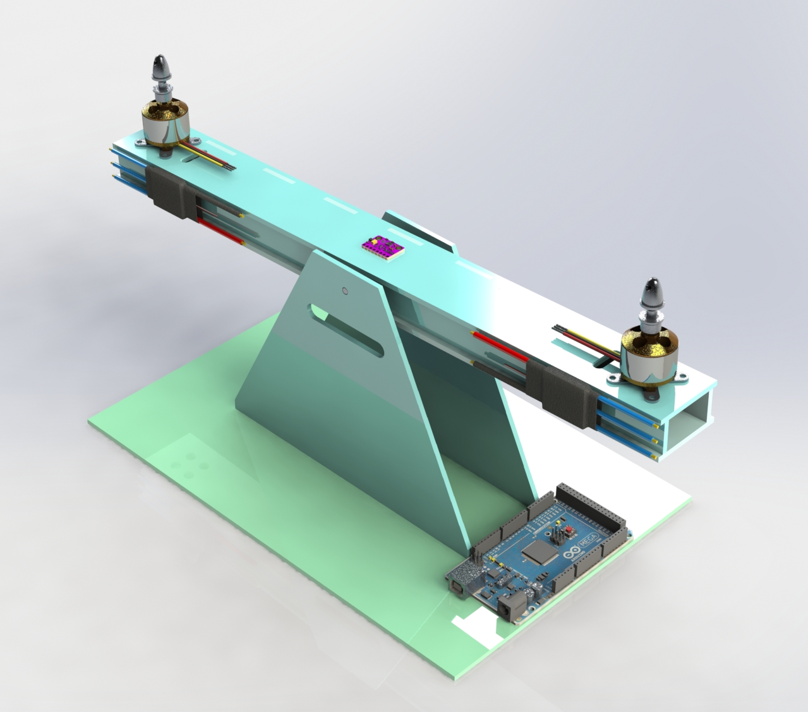

# Aero PID Control

PID controller using two brushless motors with its respective ESC, and an Arduino Mega 2560.

In order for the project to work, make sure to calibrate both ESC before running the main code. You gotta make sure you have installed the [Servo](https://www.arduino.cc/reference/en/libraries/servo/) and [Wire](https://www.arduino.cc/reference/en/language/functions/communication/wire/) Arduino libraries.
    
    #include <Servo.h>
    #include <Wire.h>

To read MPU's raw accelerometer and gyroscope data, we must register our MPU's hex addresses. Just as follows:

    // Accelerometer raw data
    Acc_rawX = Wire.read() << 8 | Wire.read();
    Acc_rawY = Wire.read() << 8 | Wire.read();
    Acc_rawZ = Wire.read() << 8 | Wire.read();
    
    // Gyro raw data
    Gyr_rawX = Wire.read() << 8 | Wire.read();
    Gyr_rawY = Wire.read() << 8 | Wire.read();

If you'd like to make any changes, you can check the MPU6050's [datasheet](https://invensense.tdk.com/wp-content/uploads/2015/02/MPU-6000-Register-Map1.pdf) anytime you want. 

Ideal Aero PID Controller structure.

Use any other Arduino board as long as SDA and SCL pins are available.